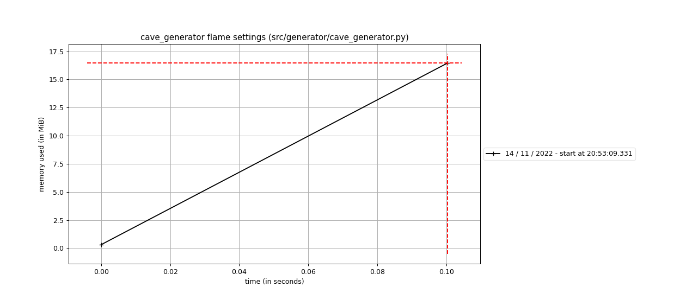
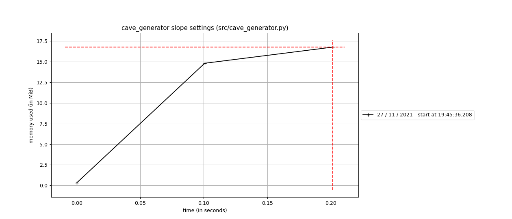

# Suorituskyky testausdokumentti

Note: Tämän dokumentin sisältö tulee vielä lisääntymään huomattavasti kun varsinaisen koodin ja sitä myötä testien määrä lisääntyy. Myös ulkoasussa on vielä tekemistä.

## Suorituskyvin testauksessa on käytetty kahta yleiskäyttöistä työkalua:
* /usr/bin/time
* python memory profiler

https://man7.org/linux/man-pages/man1/time.1.html

https://pypi.org/project/memory-profiler/

### Suorituskyvin testausscriptit ovat hakemistossa performance_test/

``` bash
install_dependencies.sh
run_tests.sh
```

### Testien ajaminen

Suorituskykytestien ajaminen tapahtuu komennolla ```bash performance_test/run_tests.sh```

Tämä ajaa scriptissä määritellyt python-tiedostot sekä python 
memory profilerilla että ```/usr/bin/time``` -komennolla.

Tulokset kopioidaan doc/resources/ -hakemistoon.

## Suorituskykytestien tulokset

### cave_generator.py

### /usr/bin/time

tulokset:
doc/resource/time_cave_generator_*.txt tiedostot

#### Python Memory Profiler





